# ASPARe

**Automated Security Posture Assessment & Remediation Engine**  
*Automated Cloud Storage Misconfiguration Detection & Remediation*

> ASPARe is a deterministic cloud-storage security platform. This repository is the **approximately 50% milestone**: a working AWS S3 baseline that discovers buckets, normalizes events, detects misconfigurations with reviewed policies, classifies risk, remediates automatically where allowed, verifies the result, and records an audit trail that a local dashboard can display.

This is **not** an LLM product yet. Review I calls for contextual analysis, anomaly detection, finding fusion, and multi-cloud coverage. Those capabilities are reserved for the remaining 50% and consume the evidence model built here.

## Implementation status

**Approximately 50% — deterministic baseline.**

| Implemented now | Reserved for the remaining 50% |
| --- | --- |
| AWS S3 discovery, inventory, CloudTrail/event normalization | LLM contextual analysis and recommendations |
| Five S3 detection rules and a Policy Knowledge Base | Anomaly detection, fusion, false-positive reduction |
| Risk evaluation, remediation, verification, audit, dashboard | Azure Blob Storage and Google Cloud Storage |
| Unit tests, mocked AWS tests, guarded live demo | Dynamic least-privilege policy generation |

See [docs/IMPLEMENTATION_STATUS.md](docs/IMPLEMENTATION_STATUS.md) and [docs/roadmap/future-work.md](docs/roadmap/future-work.md).

## Quick start

```bash
python -m venv .venv
source .venv/bin/activate
pip install -e ".[dev,dashboard]"

pytest
python -m aspare.cli --mode mocked
streamlit run dashboard/app.py
```

The mocked demo creates an isolated insecure bucket with [moto](https://docs.getmoto.org/), runs the real pipeline, and writes `var/audit/aspare.jsonl`. Refresh the dashboard after the demo.

Live AWS is opt-in and **creates its own uniquely named bucket**:

```bash
python -m aspare.cli --mode live --confirm ASPARE-LIVE-DEMO --cleanup
```

## Architecture

```mermaid
flowchart LR
    CloudTrail[CloudTrailManagementEvents] --> DetectionLambda[DetectionLambda]
    InventorySchedule[ScheduledInventoryScan] --> DetectionLambda
    DemoCLI[MockedOrLiveDemoCLI] --> DetectionWorkflow[DetectionWorkflow]
    DetectionLambda --> EventNormalizer[EventNormalizer]
    EventNormalizer --> StorageInventory[StorageInventory]
    StorageInventory --> S3Inspector[S3Inspector]
    S3Inspector --> DetectionEngine[DetectionEngine]
    PolicyKnowledgeBase[PolicyKnowledgeBase] --> DetectionEngine
    DetectionEngine --> FindingNormalizer[FindingNormalizer]
    FindingNormalizer --> RiskEvaluator[RiskEvaluator]
    PolicyKnowledgeBase --> RiskEvaluator
    RiskEvaluator -->|"AUTO_REMEDIATE"| FindingBus[ASPAReEventBus]
    RiskEvaluator -->|"ALERT_AND_LOG or LOG_ONLY"| AuditRepository[AuditRepository]
    FindingBus --> RemediationLambda[RemediationLambda]
    RemediationLambda --> RemediationEngine[RemediationEngine]
    RemediationEngine --> S3Remediator[S3Remediator]
    S3Remediator --> VerificationEngine[VerificationEngine]
    VerificationEngine --> S3Inspector
    VerificationEngine --> AuditRepository
    DetectionWorkflow --> AuditRepository
    AuditRepository --> ReportingAggregator[ReportingAggregator]
    ReportingAggregator --> StreamlitDashboard[StreamlitDashboard]
```



Detection never receives a write-capable AWS client. A successful `Put*` API response is not treated as success until the originating detector is re-run against a fresh inventory snapshot.

## Documentation map

- [Documentation home](docs/README.md)
- [Architecture overview](docs/architecture/overview.md)
- [Detection engine](docs/architecture/detection-engine.md)
- [Remediation engine](docs/architecture/remediation-engine.md)
- [Verification](docs/architecture/verification.md)
- [Infrastructure](docs/architecture/infrastructure.md)
- [Threat model](docs/security/threat-model.md)
- [Permissions](docs/security/permissions.md)
- [Detection rules](docs/implementation/detection-rules.md)
- [Remediation rules](docs/implementation/remediation-rules.md)
- [Demo guide](docs/DEMO_GUIDE.md)
- [Glossary](docs/GLOSSARY.md)
- [Legacy prototype](legacy/README.md)

## Technology stack

- Python 3.11+ (developed against 3.14)
- boto3 for AWS S3
- EventBridge + Lambda for the optional deployed path
- Streamlit for the local dashboard
- pytest + moto for tests and the mocked demonstration
- CloudFormation for demonstration-grade infrastructure

## Safety

ASPARe remediates only buckets that are allowlisted **and** tagged `ASPAReDemo=true` by default. It does not delete unrelated bucket policies, does not touch IAM users or security groups from the original prototype, and does not scan Azure or GCP.
