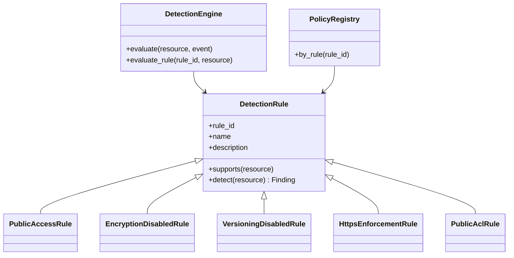

# Detection engine

> Rules inspect an immutable `StorageResource` and return a `Finding` or `None`. They never call S3 write APIs.

## Overview

`DetectionEngine` holds a list of `DetectionRule` implementations. Each S3 rule is bound to a reviewed `PolicyDefinition` from the Policy Knowledge Base so title, severity, action ID, and standards references stay consistent.

## Architecture

## How it works

1. `supports()` filters by resource type (`s3_bucket` today).
2. `detect()` reads only snapshot fields (PAB, encryption, versioning, policy, ACL, ownership).
3. `normalize_finding()` assigns a deterministic ID, copies a sanitized `before_state`, and records evidence in `metadata`.
4. API/permission errors on a control produce **no finding** for that control rather than a false positive.

## Implementation details

| Rule ID | Severity | Evidence |
| --- | --- | --- |
| `S3_PUBLIC_ACCESS` | CRITICAL | All four PAB flags true |
| `S3_ENCRYPTION_DISABLED` | HIGH | Explicit SSE-S3 or KMS config |
| `S3_VERSIONING_DISABLED` | MEDIUM | Versioning status `Enabled` |
| `S3_HTTPS_ENFORCEMENT_MISSING` | HIGH | Deny `aws:SecureTransport=false` on bucket and objects |
| `S3_PUBLIC_ACL_EXPOSURE` | CRITICAL | No AllUsers/AuthenticatedUsers grants; `BucketOwnerEnforced` is compliant |

Modern S3 may encrypt objects even when `GetBucketEncryption` reports no customer configuration. ASPARe still requires an **explicit** default encryption configuration because that is the auditable control.

## Security considerations

Detectors are constructed in `aspare.runtime` without a `StorageRemediator`. Adding a boto3 write call to a rule would be an architectural defect; tests instantiate rules with dataclass fixtures only.

## Failure scenarios

If inventory fails (`NoSuchBucket`), the workflow records `SCAN_COMPLETED/FAILED` and does not emit findings.

## Example

A bucket with all PAB flags false yields `S3_PUBLIC_ACCESS` with `remediation_action=S3_BLOCK_PUBLIC_ACCESS` and `auto_remediable=true`. Risk evaluation, not the rule, decides to auto-remediate.

## Testing

`tests/unit/test_s3_rules.py` covers secure, public, unencrypted, versioning-disabled, missing-HTTPS, unsafe-ACL, and ACL-disabled fixtures.

## Future improvements

Additional CSPM rules and non-S3 resource types belong in the remaining 50%. The engine already accepts any `DetectionRule`.
