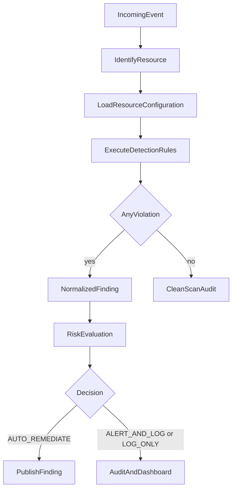
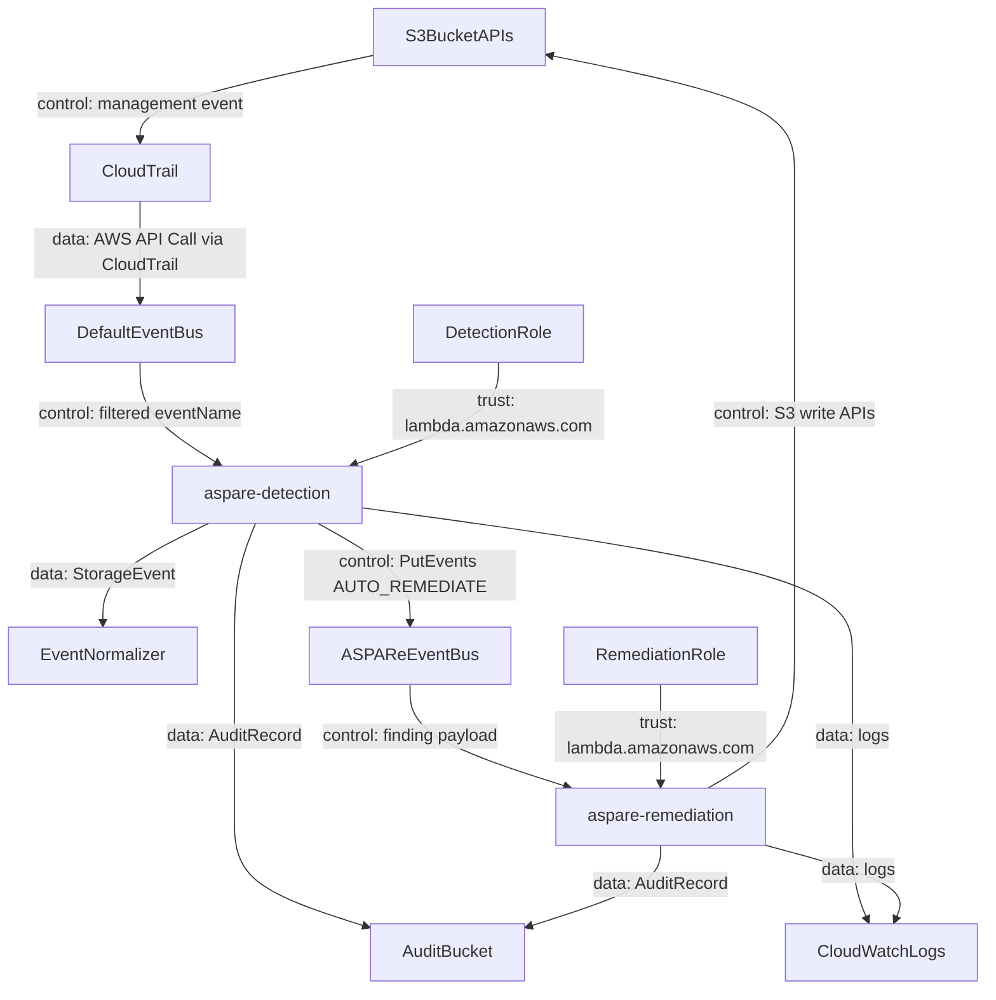
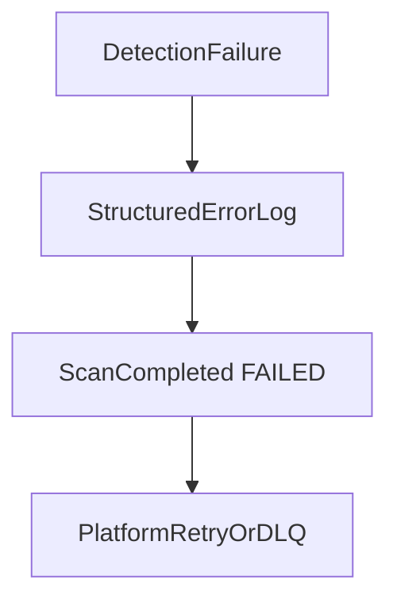

# Event flow

> Every AWS, scheduled, or demo input is reduced to a `StorageEvent` before inventory or detection runs.

## Overview

The original remediator consumed `event["detail"]` directly. ASPARe parsers emit a provider-neutral event with `provider`, `event_type`, `resource_type`, `resource_id`, `actor`, `timestamp`, `correlation_id`, and `metadata`.

## Architecture



## How it works

### Step 1 — Parse

`EventNormalizer` routes on `source` / `detail-type`:

- `AWS API Call via CloudTrail` → CloudTrail parser (S3 bucket from `requestParameters.bucketName`)
- `aspare.scheduler` → one event per bucket, or `resource_id=*` for allowlist inventory
- `aspare.demo` / direct scan → bucket from `detail.bucket`

### Step 2 — Inventory

`InventoryService` asks the AWS S3 inspector for a snapshot: Public Access Block, encryption, versioning, policy, ACL, ownership, tags. Missing configurations are distinguished from `ClientError` permission failures.

### Step 3 — Detect and classify

The detection engine runs every supporting rule. Risk evaluation assigns `AUTO_REMEDIATE`, `ALERT_AND_LOG`, `LOG_ONLY`, or `MANUAL_REVIEW`.

## Event-driven AWS path



Control flow is EventBridge → Lambda. Data flow is snapshots, findings, and audit JSON. They are intentionally not the same arrows: detection can fail closed without writing to S3 storage buckets.

## Failure scenarios



If CloudTrail delivery is delayed, the scheduled scan still inspects the allowlisted bucket. ASPARe assumes at-least-once delivery; finding IDs are deterministic per resource + rule + event.

## Example

A `PutBucketPublicAccessBlock` CloudTrail event with `bucketName=demo-bucket` becomes:

```text
provider=aws
event_type=cloudtrail_api_call
resource_type=s3_bucket
resource_id=demo-bucket
actor=arn:aws:iam::...:user/...
```

## Testing

See `tests/unit/test_events.py` and the CloudTrail fixture `tests/fixtures/cloudtrail_put_pab.json`.

## Future improvements

Remaining 50%: EventBridge archive/replay, SQS buffers, and multi-account event buses.
