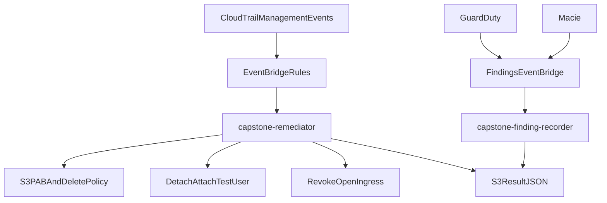
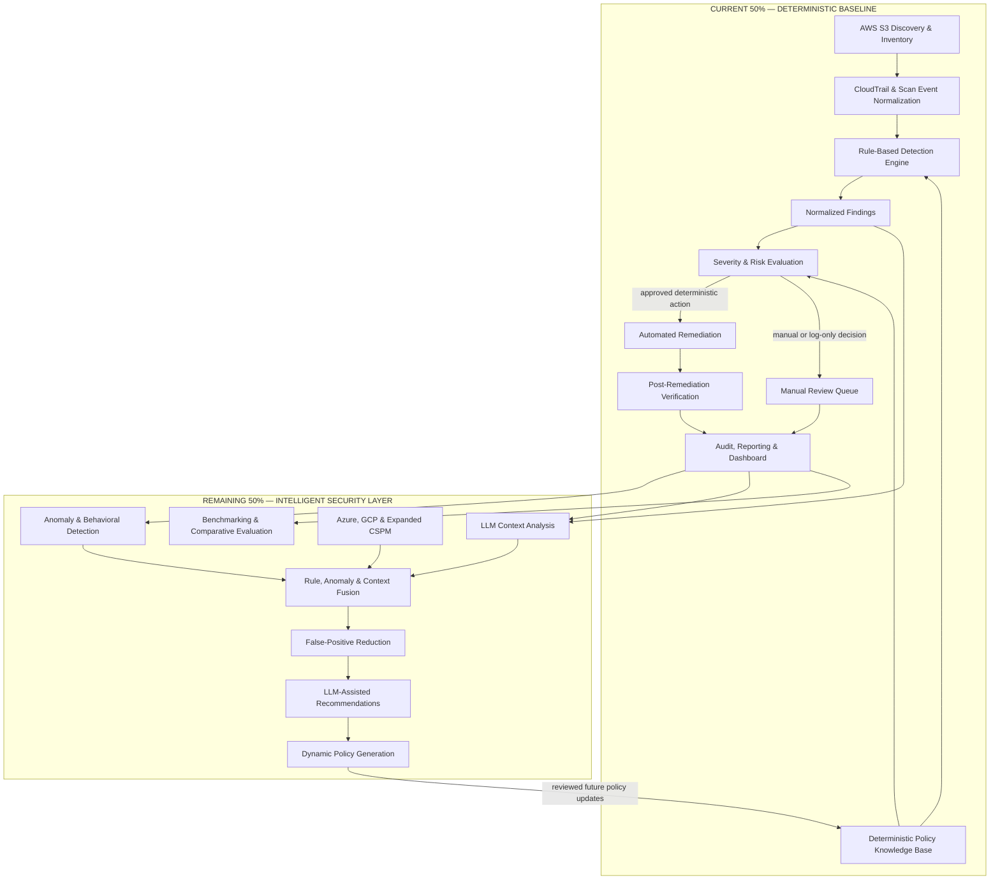

# Architecture overview

> ASPARe separates discovery, detection, risk, remediation, verification, and audit so scanning cannot mutate storage and a successful API call is never confused with a verified fix.

## Overview

The original repository was a two-Lambda console export. One function parsed CloudTrail events and immediately mutated S3, IAM, and EC2. The other stored raw GuardDuty/Macie envelopes. There were no findings, no rules, no verification, and no tests.

ASPARe replaces that coupling with a domain pipeline that both the local demo and the optional Lambda deployment execute.

## Why these layers exist

### Why detection and remediation are separated

- **Testability:** rules return `Finding` objects against in-memory resource snapshots.
- **Safety:** detectors are never constructed with a write-capable client.
- **Least privilege:** the detection IAM role cannot `PutBucketPolicy`.
- **Auditability:** each stage emits its own audit action.
- **Extensibility:** new rules do not rewrite remediations.

### Why findings are normalized

Downstream risk, remediation, reporting, and a future LLM/anomaly layer all need the same fields: resource, rule, severity, evidence, and action hint. Provider-specific API shapes stop at the inspector.

### Why verification exists

S3 is eventually consistent. IAM policy evaluation can conflict with a new statement. An API can return 200 while the configuration is unchanged. Verification re-reads the bucket and re-runs the originating rule.

### Why risk evaluation is separate

Severity is a property of the control. Response (auto-remediate vs alert) is a property of the organization. The default policy auto-fixes Critical/High and alerts on Medium so versioning can be enabled later without changing the detector.

## Starting architecture

## Redesigned architecture

## Comparison

| Area | Initial design | Redesigned system |
| --- | --- | --- |
| Detection | EventBridge match + `if eventName` | Five independently testable S3 rules |
| Remediation | Same Lambda mutates the resource | Separate engine, actions, and Lambda |
| Findings | None (raw events) | Normalized `Finding` model |
| Verification | None (`status=success` after API) | Re-read + re-run originating rule |
| Risk evaluation | None | Policy file maps severity to decision |
| Audit | Ad-hoc result JSON | Structured `AuditRecord` JSONL/S3 |
| Extensibility | Hard-coded S3/IAM/SG branches | Provider protocols; Azure/GCP reserved |
| Dashboard | None | Streamlit over audit records |
| Tests | None | Unit + mocked AWS integration |

## Module map

| Concern | Package |
| --- | --- |
| Domain types | `aspare.core` |
| Settings | `aspare.config` |
| Events | `aspare.events` |
| Inventory | `aspare.inventory` |
| Policies | `aspare.policy` |
| Detection | `aspare.detection` |
| Risk | `aspare.risk` |
| Remediation | `aspare.remediation` |
| Verification | `aspare.verification` |
| Audit | `aspare.audit` |
| AWS S3 | `aspare.providers.aws` |
| Workflows | `aspare.workflows` |
| Lambda | `aspare.handlers` |

IAM, EC2, GuardDuty, and Macie from the prototype are archived under [`legacy/`](../legacy/README.md) and are not imported.

## Testing

Architecture invariants are enforced in unit tests (rules never call boto3) and integration tests (moto pipeline). See [testing strategy](../testing/strategy.md).

## Future improvements

The remaining 50% attaches to `Finding`, `AuditRecord`, and `PolicyDefinition` rather than rewriting inspectors. See [future work](../roadmap/future-work.md).
