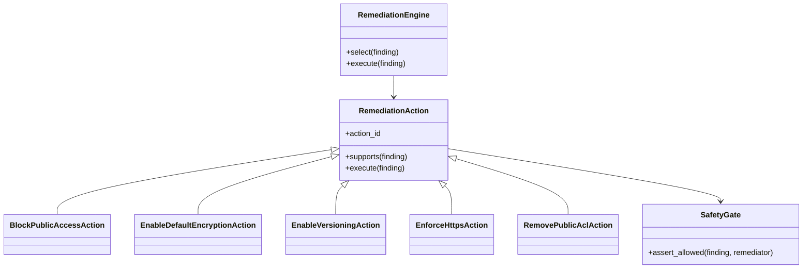
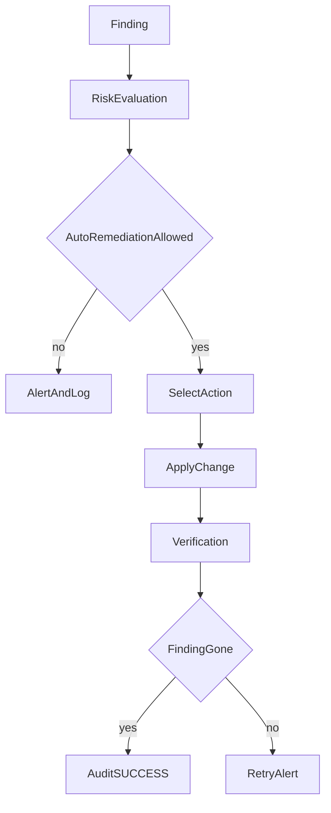
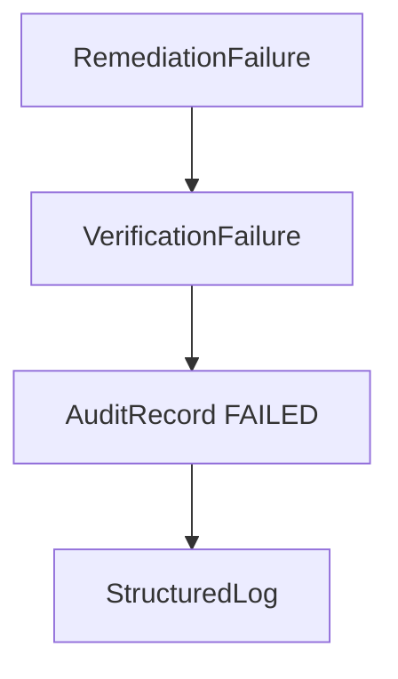

# Remediation engine

> Remediation is a registry of actions keyed by reviewed policy IDs. Actions mutate AWS only through `StorageRemediator`, and only after a safety gate.

## Overview

The original `remediate_s3()` always enabled Public Access Block **and deleted any bucket policy**. ASPARe does not delete unrelated statements. HTTPS enforcement **merges** a reviewed Deny statement (`ASPAReDenyInsecureTransport`).

## Architecture

## Automated remediation flow

## How it works

1. Risk decision must be `AUTO_REMEDIATE` (Critical/High and auto-remediable by default).
2. `SafetyGate` requires the bucket to be allowlisted and tagged `ASPAReDemo=true` unless tests disable the tag check.
3. Dry-run returns `DRY_RUN` without calling S3 writes.
4. Action failures become `ActionResultStatus.FAILED` or `DENIED`; they never raise into an unlogged 200 the way the prototype did.

## Implementation details

Default risk policy **does not auto-run versioning** because it is MEDIUM → `ALERT_AND_LOG`. The `S3_ENABLE_VERSIONING` action is still registered for explicit/manual or alternate policies.

HTTPS “policy generation” in this milestone is template rendering, not LLM generation.

## Security considerations

Unauthorized remediation is mitigated by allowlist + demo tag + a write role that can only target the allowed bucket ARN. ASPARe will not remediate an arbitrary bucket discovered in CloudTrail.

## Failure scenarios

If audit persistence fails after a mutation, ASPARe logs a fallback payload and **raises** so Lambda retries can reconcile state.

## Example

Public access finding → `S3_BLOCK_PUBLIC_ACCESS` → `put_public_access_block` with all four flags true → verification via `PublicAccessRule`.

## Testing

`tests/unit/test_remediation_selection.py` and `tests/integration/test_mocked_aws.py`.

## Future improvements

Manual approval gates, change tickets, and generated least-privilege policies are remaining-50% work.
