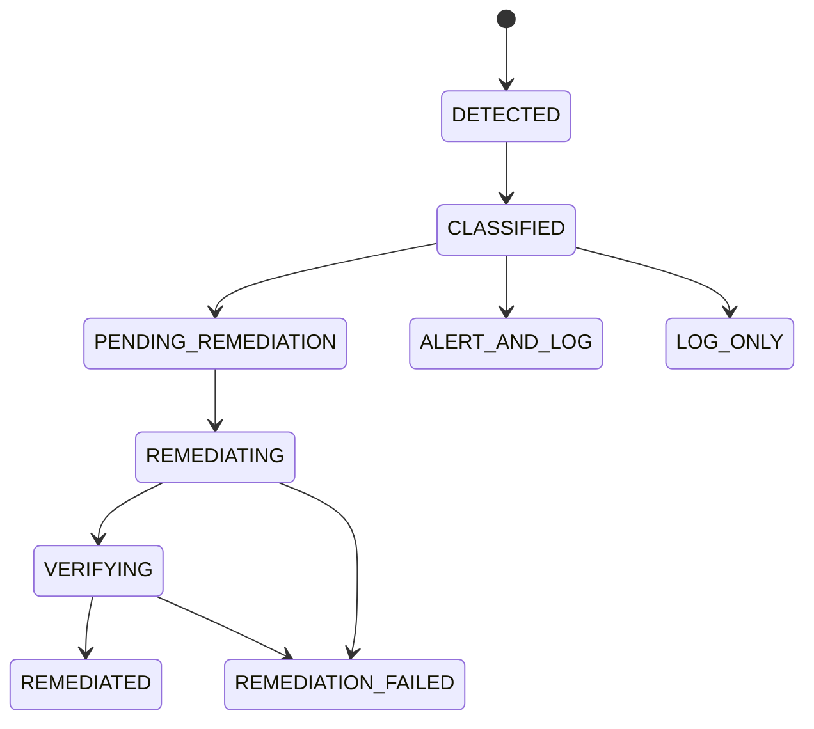

# Verification

> Remediation is not success. Verification re-reads the bucket and re-runs the exact originating detector.

## Overview

The prototype set `status=success` after boto3 calls. ASPARe returns `VERIFIED` only when that detector returns `None` on a fresh snapshot.

## Architecture

## How it works

1. If the action failed, denied, or was a dry-run, verification records `ACTION_FAILED` or `UNSUPPORTED` and does not claim success.
2. Re-read through `S3Inspector`. Failures become `REREAD_FAILED`.
3. `DetectionEngine.evaluate_rule(rule_id, resource)` runs only the originating control.
4. A remaining finding becomes `FINDING_PERSISTED` → lifecycle `REMEDIATION_FAILED`.

## Implementation details

Verification does not run the entire rule pack. Encryption remaining after a public-access fix is a separate finding, not a failed public-access remediation.

## Security considerations

Incomplete verification is treated as failure. Operators should not assume the bucket is safe because EventBridge invoked the remediator.

## Failure scenarios

Eventual consistency can cause `FINDING_PERSISTED`. The remaining 50% may add bounded retries; this milestone records failure honestly.

## Example

After HTTPS merge, `HttpsEnforcementRule` must observe a Deny with `aws:SecureTransport=false` covering `arn:aws:s3:::bucket` and `arn:aws:s3:::bucket/*`.

## Testing

`tests/unit/test_verification.py` covers success, action failure, re-read failure, and persistent findings.

## Future improvements

Drift detection on a schedule reuses the same engine: a later scan that re-emits a finding is configuration drift.
