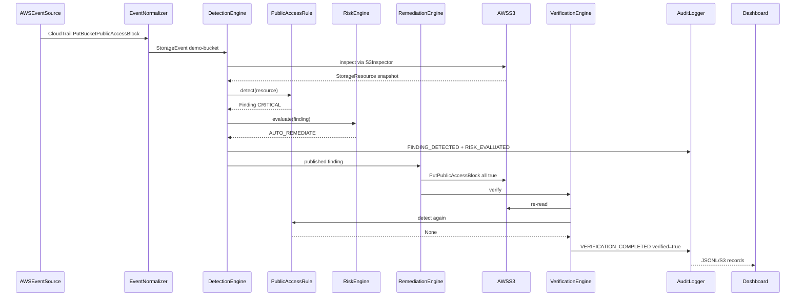

# Detection rules

> Five reviewed S3 controls from the Policy Knowledge Base. Each detector returns a normalized finding or `None`.

## Overview

Policies live in [`config/policies/s3.json`](../../config/policies/s3.json). Code in `aspare.detection.rules.s3` implements evidence collection only.

## Rule catalog

| Policy ID | Rule ID | Severity | Auto-remediable | Action |
| --- | --- | --- | --- | --- |
| POL-S3-PUBLIC-ACCESS | S3_PUBLIC_ACCESS | CRITICAL | yes | S3_BLOCK_PUBLIC_ACCESS |
| POL-S3-ENCRYPTION | S3_ENCRYPTION_DISABLED | HIGH | yes | S3_ENABLE_DEFAULT_ENCRYPTION |
| POL-S3-VERSIONING | S3_VERSIONING_DISABLED | MEDIUM | yes (action exists; default risk alerts) | S3_ENABLE_VERSIONING |
| POL-S3-HTTPS | S3_HTTPS_ENFORCEMENT_MISSING | HIGH | yes | S3_ENFORCE_HTTPS |
| POL-S3-PUBLIC-ACL | S3_PUBLIC_ACL_EXPOSURE | CRITICAL | yes | S3_REMOVE_PUBLIC_ACL |

## Sequence for a real remediation event

## Testing

Each rule has a secure-negative and a misconfigured-positive fixture.

## Future improvements

CIS coverage beyond these five controls, plus Azure/GCP analogues.
