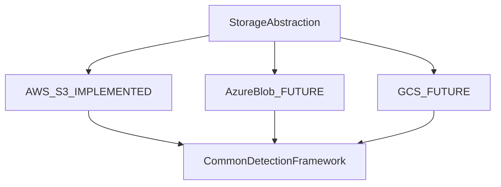

# Future work — remaining 50%

> The deterministic baseline is the evaluation substrate for the intelligent/research layer described in Review I.

## Reserved capabilities

- LLM-assisted contextual analysis and misconfiguration reasoning
- LLM-assisted remediation recommendations
- Dynamic least-privilege policy generation (with human review)
- Anomaly and behavioral detection
- Rule + anomaly + context fusion
- Confidence scoring from multiple **real** evidence sources (not dummy scores)
- Advanced false-positive reduction and finding correlation
- Azure Blob Storage and Google Cloud Storage adapters
- Expanded CSPM/compliance libraries
- Production persistence, distributed scanning, approval UX, alert delivery
- Research benchmarks comparing rule-only vs fused detection

## Extension points already present

- `Provider` enum values `azure` and `gcp`
- `StorageProvider` / `StorageInspector` / `StorageRemediator` protocols
- `Finding` and `AuditRecord` schemas
- `PolicyRegistry` as a versioned knowledge base

Do not add cosmetic AI modules in the meantime.

