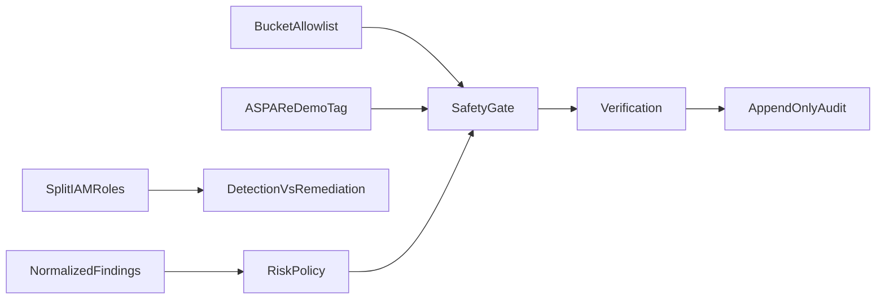

# Security controls

> Controls actually implemented in this milestone, with honest gaps.

## Overview

## Implemented

- Application allowlist and demo tag
- Split detection/remediation IAM in the template
- Narrow EventBridge `eventName` filters (not all S3 APIs)
- Idempotent actions (PAB put, encryption put, versioning enable, Sid replace, ACL rewrite)
- Structured audit with before/after state
- Recursion is avoided architecturally: remediator does not subscribe to its own CloudTrail noise beyond the filtered names; self-writes still go through allowlist

## Not implemented (do not assume)

- WAF, private API, dashboard authentication
- Customer-managed KMS on the audit bucket
- SNS/Security Hub tickets
- Multi-account Organizations integration
- LLM-based approval of remediations

## Testing

Controls are covered by unit safety-gate tests and integration allowlist tests.

## Future improvements

See [future work](../roadmap/future-work.md).
