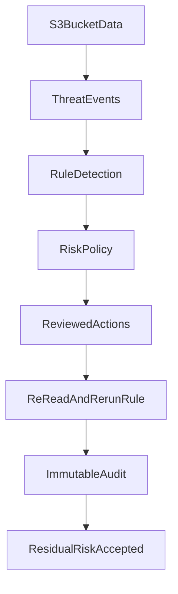

# Threat model

> ASPARe’s first milestone exists because public buckets, missing TLS, and unverified remediations are common and expensive. This page describes threats the deterministic controls actually address, and the residual risk that remains.

## Overview

## Threats

### Publicly exposed bucket

- **Impact:** anonymous listing or object reads.
- **Detection:** `S3_PUBLIC_ACCESS`, `S3_PUBLIC_ACL_EXPOSURE`.
- **Remediation:** enable all PAB flags; remove public ACL grants.
- **Residual risk:** object ACLs on existing objects, account-level PAB exceptions, and replication to another public bucket.

### Unencrypted objects

- **Impact:** plaintext at rest relative to the organization’s encryption policy.
- **Detection:** `S3_ENCRYPTION_DISABLED` (explicit default encryption missing or noncompliant).
- **Remediation:** put AES256 or configured KMS default encryption.
- **Residual risk:** AWS baseline encryption may already apply; KMS key policy can still be too broad.

### Missing transport security

- **Impact:** credentials or objects on unencrypted HTTP.
- **Detection:** no Deny for `aws:SecureTransport=false`.
- **Remediation:** merge reviewed HTTPS statement.
- **Residual risk:** conflicting Allow statements do not override an explicit Deny, but a later human delete of the Sid reopens the hole (drift).

### Unsafe ACLs

- **Impact:** AllUsers/AuthenticatedUsers grants.
- **Detection:** ACL grant URIs; `BucketOwnerEnforced` is treated as ACL-disabled/compliant.
- **Remediation:** rewrite ACL without public grants.
- **Residual risk:** object-level ACLs not inspected in this milestone.

### Unauthorized remediation

- **Impact:** a compromised scanner disables encryption or rewrites policy on production buckets.
- **Detection:** operational / IAM review, not an S3 content rule.
- **Remediation:** allowlist + `ASPAReDemo=true` + split IAM roles.
- **Residual risk:** overly broad `ASPARE_ALLOWED_BUCKETS` or disabled demo-tag requirement.

### Excessive IAM permissions

- **Impact:** detection role becomes a write role.
- **Mitigation:** template splits roles; detection cannot `PutBucketPolicy`.
- **Residual risk:** operators attaching extra managed policies outside the template.

### Event spoofing

- **Impact:** fake EventBridge events trigger scans.
- **Mitigation:** Lambda permissions source-ARN restricted; actions still gated by allowlist.
- **Residual risk:** anyone who can invoke the function in-account can request a scan of the allowed bucket.

### Remediation failure / incomplete verification

- **Impact:** dashboard shows success while the bucket is still public.
- **Mitigation:** verification required; API 200 is insufficient.
- **Residual risk:** eventual consistency windows.

### Configuration drift

- **Impact:** a later console click undoes HTTPS Deny.
- **Mitigation:** CloudTrail-triggered and scheduled scans re-detect.
- **Residual risk:** no continuous compliance guarantee between scans.

## Security assumptions

- AWS credentials used by the runtime are trusted.
- Only tagged/allowlisted buckets may be mutated.
- CloudTrail delivery is at-least-once and may be delayed.
- This is **not** an enterprise CSPM SLA.

## Testing

Threats map onto unit fixtures (public, unencrypted, missing HTTPS, unsafe ACL) and the mocked pipeline.

## Future improvements

Anomaly detection for unusual remediation bursts belongs in the remaining 50%.
